### 一、技术背景
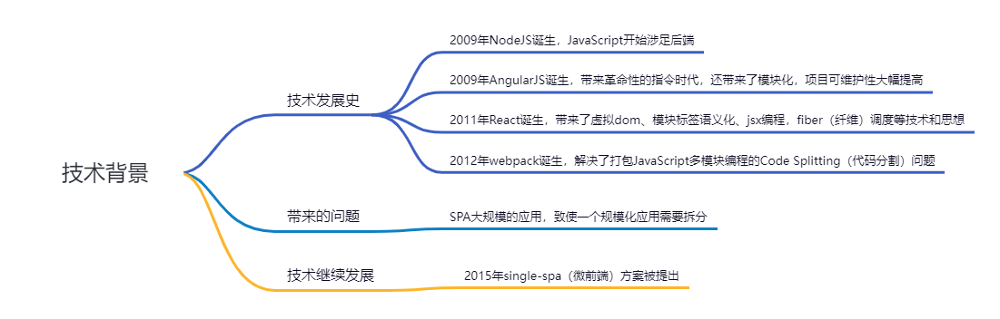

### 二、了解微前端
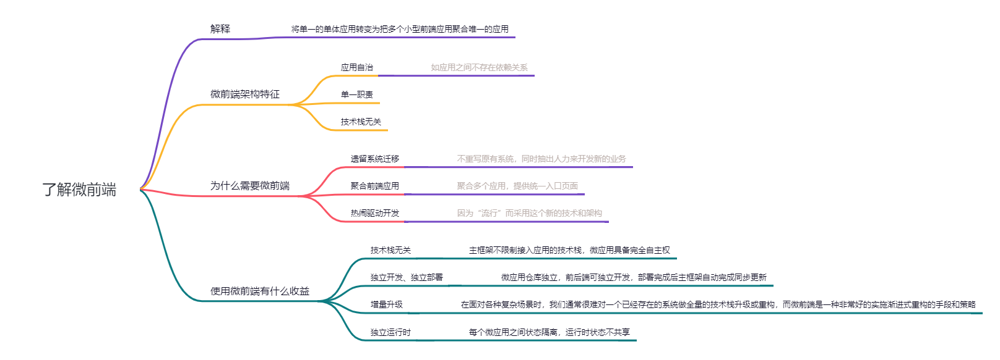

### 三、微前端架构技术实现方式
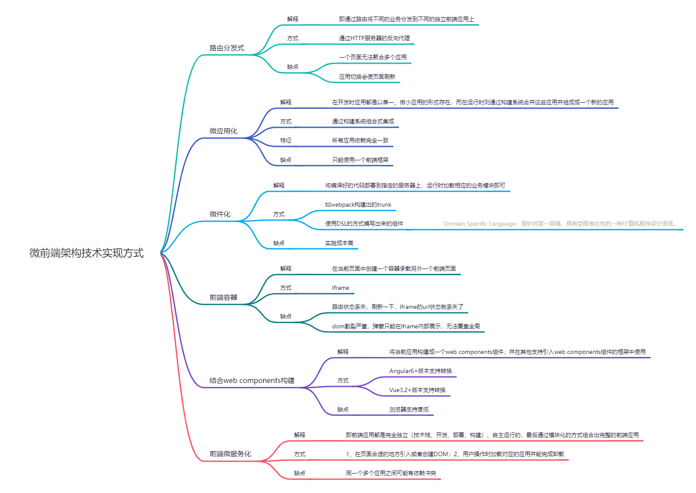

##### 3.1 路由分发式
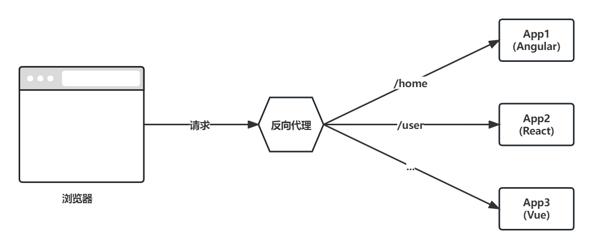

##### 3.2 微应用化
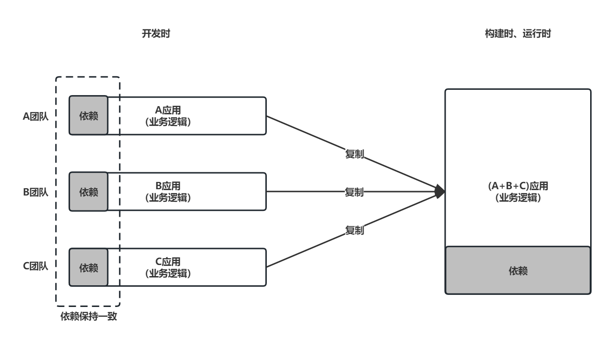

##### 3.3 微件化
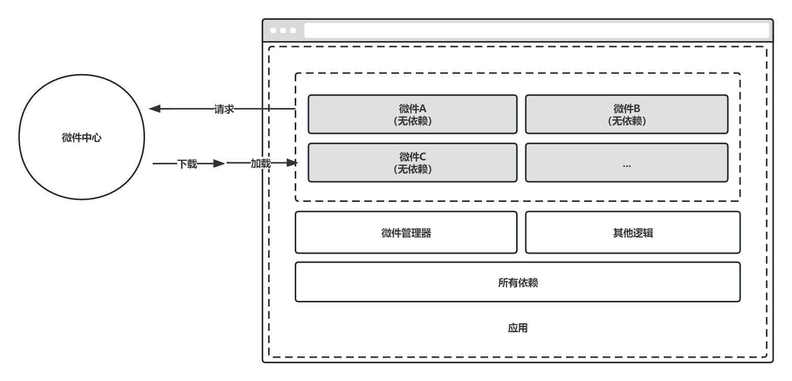

##### 3.4 前端容器
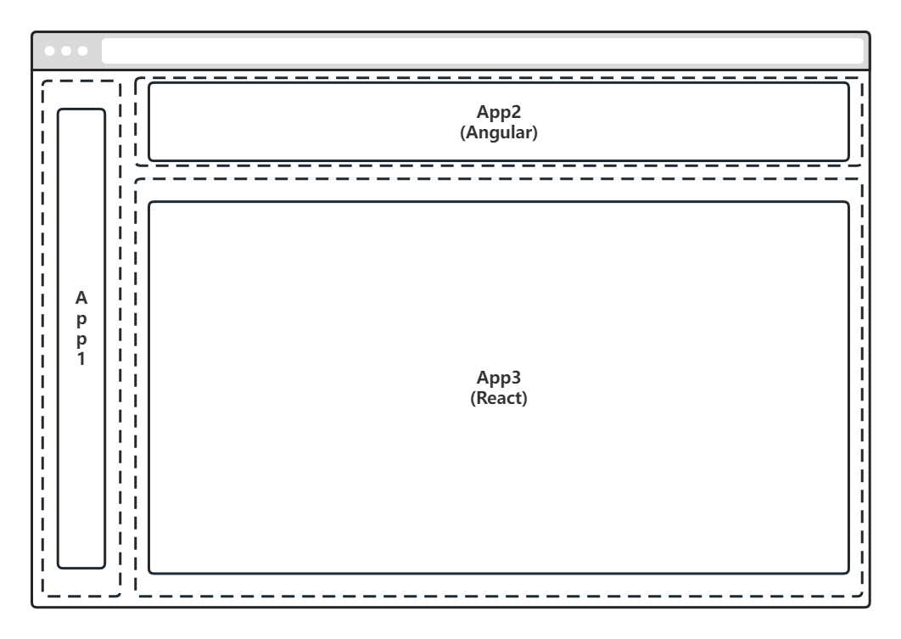

##### 3.5 结合web components构建
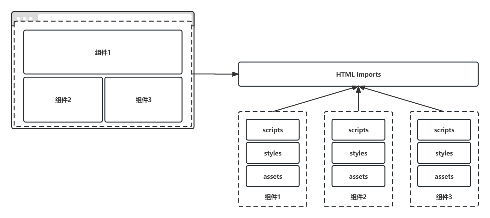

##### 3.6 微服务化
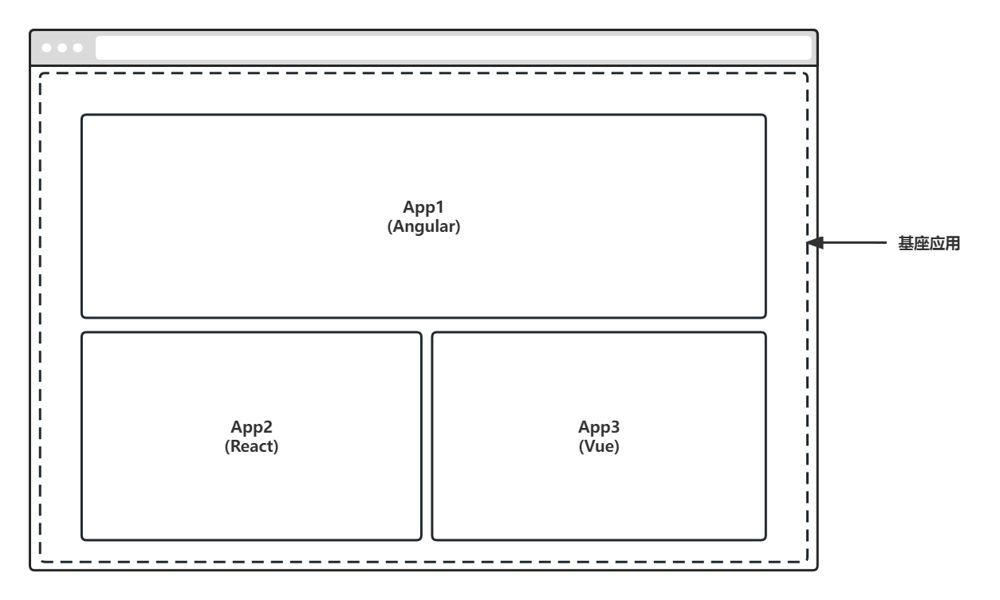

### 四、微前端的业务划分方式
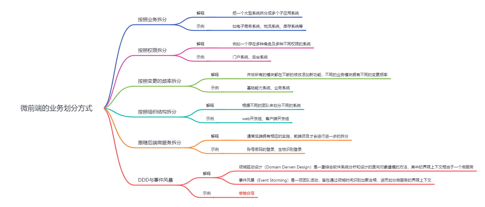

### 五、微前端的架构设计
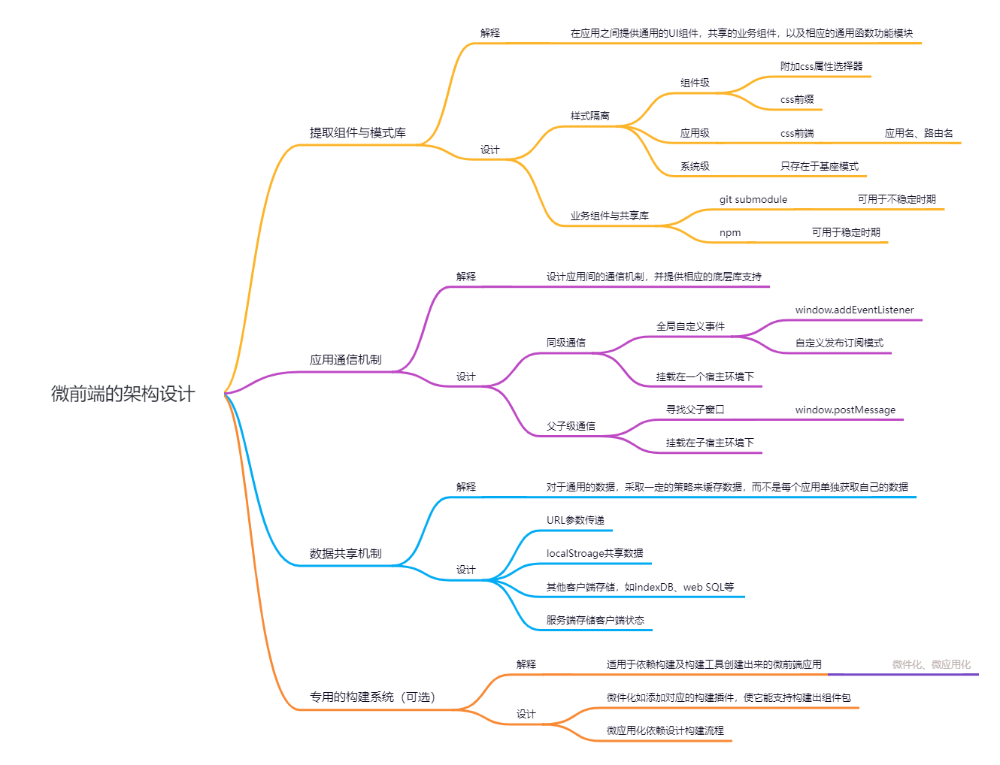

### 六、微前端的架构模式
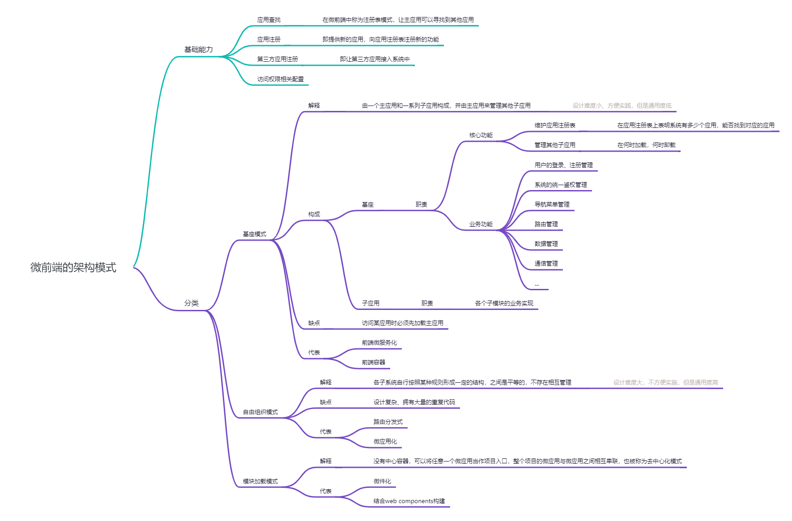

##### 6.1 基座模式
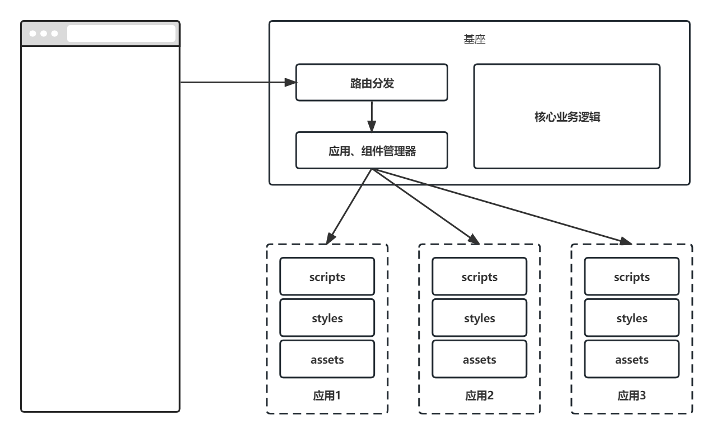

### 七、微前端的设计理念
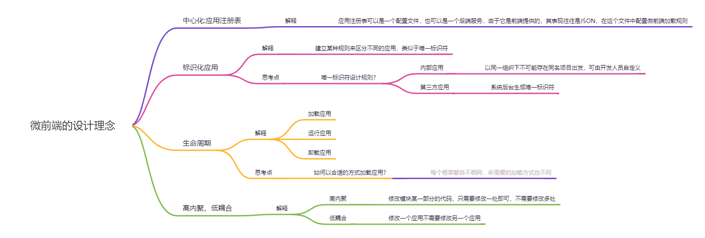

### 八、微前端的落地方案
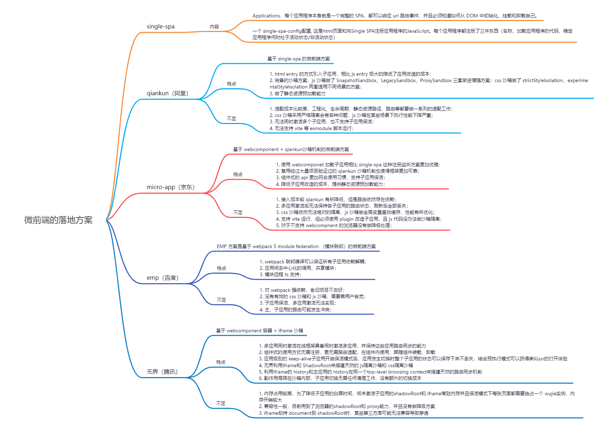

##### 8.1 框架对比（三款微服务化）
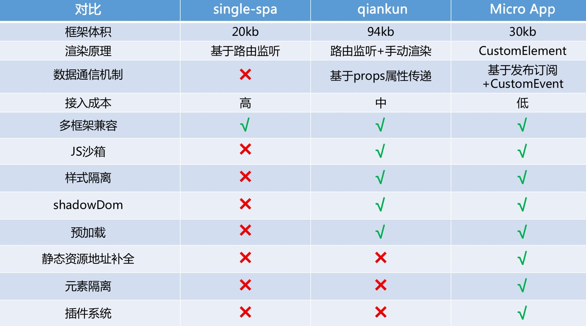

### 九、应用场景
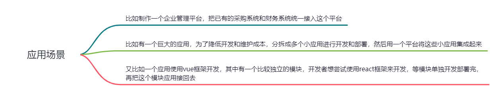

### 十、微前端面临的挑战
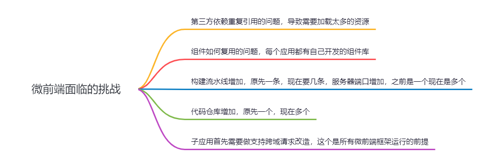